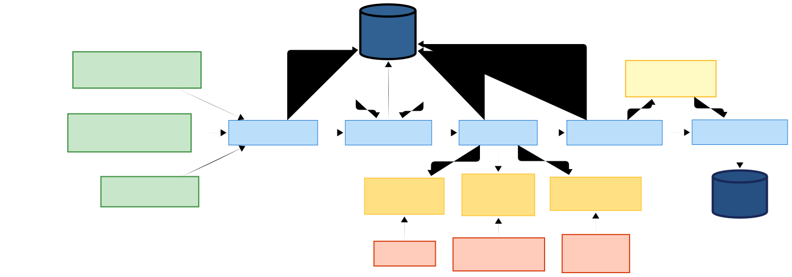

# ClimateSense KG Pipeline

[](https://python.org)
[](https://docs.astral.sh/uv/)
[](LICENSE)

> The ClimateSense KG is a continuously updated knowledge graph that integrates climate fact-checking data from multiple sources to combat climate misinformation. It links information from fact-checking organizations with enriched data, giving researchers a more comprehensive view of the problem.

## 🔍 Overview



### Key Features

- Multi-source ingestion from major climate fact-checking organizations
  - [EuroClimateCheck](https://github.com/climatesense-project/euroclimatecheck-scraper)
  - [ClaimReviewData](https://github.com/MartinoMensio/claimreview-data)
  - [DeFacto](https://defacto-observatoire.fr/Fact-checks/)
  - [DBKF](https://dbkf.ontotext.com/)
  - [DeSmog](https://github.com/climatesense-project/climate-disinformation-database)
  - [Climafacts (Skeptical-Science)](https://github.com/climatesense-project/climafacts-kg)
  - [CLIMATE-FEVER](https://www.sustainablefinance.uzh.ch/en/research/climate-fever.html)
- Data enrichment with:
  - Text extraction from URLs using [trafilatura](https://trafilatura.readthedocs.io/)
  - Entity linking using [DBpedia Spotlight](https://www.dbpedia-spotlight.org/)
  - [Factors classification](https://github.com/climatesense-project/cimple-factors-server) using fine-tuned BERT models
- RDF output using [Schema.org](https://schema.org/) and [CIMPLE ontology](https://github.com/CIMPLE-project/knowledge-base)
- Triple store deployment supporting Virtuoso and QLever
- [YAML-based configuration](#configuration)

### Documentation & Resources

- [URI design patterns](docs/URI-patterns.md) and [RDF namespaces](docs/URI-patterns.md#rdf-namespace-declarations)
- Public SPARQL endpoint: https://data.climatesense-project.eu/sparql

## 📋 Prerequisites

- Python 3.11+
- [uv](https://docs.astral.sh/uv/getting-started/installation/) (for dependency management)
- [just](https://github.com/casey/just) (for task automation)
- [Docker & Docker Compose](https://docs.docker.com/get-docker/) (for Docker setup)

## Table of Contents

- [ClimateSense KG Pipeline](#climatesense-kg-pipeline)
  - [🔍 Overview](#-overview)
    - [Key Features](#key-features)
    - [Documentation \& Resources](#documentation--resources)
  - [📋 Prerequisites](#-prerequisites)
  - [Table of Contents](#table-of-contents)
  - [Quick Start](#quick-start)
  - [Docker Setup](#docker-setup)
  - [Configuration](#configuration)
  - [Querying the cache](#querying-the-cache)
    - [Example SQL Queries](#example-sql-queries)
  - [Querying the Knowledge Graph](#querying-the-knowledge-graph)
    - [Example SPARQL Queries](#example-sparql-queries)
  - [Development](#development)
    - [Setup](#setup)
    - [Common Tasks](#common-tasks)
    - [CLI Usage](#cli-usage)
    - [QLever UI](#qlever-ui)
  - [Acknowledgments](#acknowledgments)

## Quick Start

**Install:**

```bash
git clone https://github.com/climatesense-project/climatesense-kg.git
cd climatesense-kg
just install
```

**Run:**

```bash
just run config/minimal.yaml
```

## Docker Setup

**Requirements:**

- [Docker](https://docs.docker.com/get-docker/)
- [Docker Compose](https://docs.docker.com/compose/install/)
- [just](https://github.com/casey/just)

**Initial Setup:**

1. Clone the repository and navigate to the docker directory:

   ```bash
   git clone https://github.com/climatesense-project/climatesense-kg.git
   cd climatesense-kg/docker
   ```

2. Copy and configure environment variables:

   ```bash
   cp .env.example .env
   ```

   Edit `.env` to configure:
   - `COMPOSE_PROFILES`: Select exactly one triplestore profile (`virtuoso` or `qlever`)
   - `GITHUB_TOKEN`: GitHub token used for private repositories
   - `VIRTUOSO_HOST`: Virtuoso host name (default `virtuoso`)
   - `VIRTUOSO_BIND_ADDRESS`: Host interface for the Virtuoso HTTP endpoint (default `127.0.0.1`)
   - `VIRTUOSO_PORT`: Virtuoso HTTP/SPARQL port (default `8890`)
   - `VIRTUOSO_USER`: Virtuoso database user (default `dba`)
   - `VIRTUOSO_PASSWORD`: Virtuoso database password (required; no default)
   - `VIRTUOSO_ISQL_SERVICE_URL`: Virtuoso ISQL HTTP endpoint (default `http://isql-service:8080`)
   - `ISQL_SERVICE_TOKEN`: Required bearer token shared by the pipeline and the internal ISQL helper
   - `QLEVER_ENDPOINT`: QLever Graph Store/SPARQL endpoint (default `http://qlever:7019`)
   - `QLEVER_PORT`: Published QLever port (default `7019`)
   - `QLEVER_ACCESS_TOKEN`: Required token for QLever updates and maintenance
   - `QLEVER_UPLOAD_TIMEOUT_SECONDS`: RDF upload timeout (default `7200`)
   - `QLEVER_INDEX_MEMORY`: Memory available to initial index builds (default `1G`)
   - `QLEVER_MEMORY_FOR_QUERIES`: Memory available to queries (default `5G`)
   - `QLEVER_CACHE_MAX_SIZE`: Query-result cache size (default `2G`)
   - `QLEVER_QUERY_TIMEOUT`: Default query timeout (default `30s`)
   - `QLEVER_REQUEST_BODY_LIMIT`: Maximum request body size, including RDF uploads (default `3G`)
   - `QLEVER_UI_PORT`: Published QLever UI port (default `7018`)
   - `QLEVERUI_SECRET_KEY`: Required Django signing key for QLever UI
   - `QLEVERUI_ALLOWED_HOSTS`: Hosts accepted by QLever UI
   - `QLEVERUI_CSRF_TRUSTED_ORIGINS`: Trusted browser origins for QLever UI
   - `QLEVER_UI_BACKEND_URL`: Browser-visible QLever endpoint used by the UI
   - `CIMPLE_FACTORS_API_URL`: CIMPLE Factors API base URL (default `http://localhost:8000`)
   - `POSTGRES_HOST`: Cache database host (default `postgres`)
   - `POSTGRES_BIND_ADDRESS`: Host interface for PostgreSQL (default `127.0.0.1`)
   - `POSTGRES_PORT`: Cache database port (default `5432`)
   - `POSTGRES_DB`: Cache database name (default `climatesense_cache`)
   - `POSTGRES_USER`: Cache database user (default `postgres`)
   - `POSTGRES_PASSWORD`: Cache database password (required)
   - `ANALYTICS_SPARQL_ENDPOINT`: Selected triplestore endpoint for analytics
   - `ANALYTICS_ALLOWED_ORIGINS`: Comma-separated origins permitted to call the analytics API (default `http://localhost:3000`)
   - `ANALYTICS_CACHE_TTL`: Analytics API cache TTL in seconds (default `60`)
   - `ANALYTICS_SPARQL_TIMEOUT`: SPARQL timeout in seconds for analytics queries (default `20`)
   - `NEXT_PUBLIC_ANALYTICS_API_URL`: Base URL the dashboard uses for the analytics API (default `http://localhost:8000`)
   - `ANALYTICS_API_PORT`: Published port for the analytics API container (default `8000`)
   - `ANALYTICS_UI_PORT`: Published port for the analytics UI container (default `3000`)

3. Start the services with either Virtuoso or QLever:

   - **Option 1. Virtuoso**

     Start the Virtuoso stack:

     ```bash
     just virtuoso-up
     ```

   - **Option 2. QLever**

     Build the initial QLever index and start the QLever stack:

     ```bash
     just qlever-init
     just qlever-up
     ```

4. Run the pipeline with minimal configuration to verify the setup:
   ```bash
   docker compose run --rm pipeline run -c config/minimal.yaml
   ```

## Configuration

The pipeline uses YAML-based configuration. Example config:

```yaml
data_sources:
  - name: "claimreview_sample"
    type: "claimreviewdata"
    input_path: "samples/claimreviewdata-data"
  - name: "euroclimatecheck_sample"
    type: "euroclimatecheck"
    input_path: "samples/euroclimatecheck-data"

enrichment:
  url_text_extraction:
    enabled: true
    rate_limit_delay: 0.5
    timeout: 15
    max_retries: 2

  dbpedia_spotlight:
    enabled: true
    api_url: "https://api.dbpedia-spotlight.org/en/annotate"
    confidence: 0.6
    support: 30
    timeout: 20
    rate_limit_delay: 0.2

  bert_factors:
    enabled: true
    batch_size: 32
    max_length: 128
    timeout: 30
    rate_limit_delay: 0.1

output:
  format: "turtle"
  output_path: "data/rdf/{DATE}/{SOURCE}.ttl"
  base_uri: "http://data.climatesense-project.eu"

cache:
  cache_dir: "cache"
  default_ttl_hours: 24.0

deployment:
  backend: "qlever" # none, virtuoso, or qlever
  graph_template: "http://data.climatesense-project.eu/graph/{SOURCE}"
```

`data/organizations.ttl` is the fixed, manually maintained source of truth for fact-checker identity and metadata. Each entry has an explicit stable ClimateSense IRI, one curated name, one or more website URLs, country-level location, and memberships or parent relationships where applicable. Every processor must provide an organization website, and extracted organizations resolve exclusively by normalized URL.

`data/graphs.ttl` is the curated catalog for the published named graphs.

## Querying the cache

You can use any PostgreSQL client to connect to the PostgreSQL cache database and run SQL queries.

### Example SQL Queries

```sql
-- Processing success rates by step
SELECT step, COUNT(*) AS total, COUNT(*) FILTER (WHERE success) AS successes
FROM cache_entries GROUP BY step;

-- Error analysis by domain
SELECT split_part(payload->'payload'->>'review_url', '/', 3) AS domain, COUNT(*) AS failures
FROM cache_entries WHERE success = false GROUP BY domain;
```

## Querying the Knowledge Graph

Once loaded into the selected triplestore, query the knowledge graph using SPARQL:

- **Virtuoso SPARQL Endpoint**: http://localhost:8890/sparql
- **Virtuoso Faceted Browser**: http://localhost:8890/fct
- **QLever SPARQL Endpoint**: http://localhost:7019
- **QLever UI**: http://localhost:7018

### Example SPARQL Queries

**Find all climate claims:**

```sparql
PREFIX schema: <http://schema.org/>
SELECT ?claim ?text ?rating
WHERE {
  ?claim a schema:ClaimReview ;
         schema:claimReviewed ?text ;
         schema:reviewRating ?rating .
}
LIMIT 10
```

**Find claims by fact-checking organization:**

```sparql
PREFIX schema: <http://schema.org/>
SELECT ?claim ?author ?authorName
WHERE {
  ?claim a schema:ClaimReview ;
         schema:author ?author .
  ?author a schema:Organization ;
          schema:name ?authorName .
}
LIMIT 10
```

## Development

### Setup

```bash
just setup-dev
```

### Common Tasks

```bash
just format          # Format code with ruff
just check           # Run linting and type checks
just pre-commit-all  # Run pre-commit on all files
```

### CLI Usage

```bash
# Display help
uv run climatesense-kg --help

# Run minimal pipeline with debug logging
uv run climatesense-kg run --config config/minimal.yaml --debug

# Run daily pipeline skipping data download and forcing full RDF regeneration
uv run climatesense-kg run --config config/daily.yaml --skip-download --force-regenerate

# Replace the organization catalog and redeploy existing RDF to the selected backend
uv run climatesense-kg redeploy --config config/daily.yaml --rdf-dir data/rdf
```

### QLever UI

`just qlever-up` starts the QLever engine and QLever UI.
The UI is available at http://localhost:7018 and persists its Django database in the `qlever_ui_data` Docker volume.

Create an administrator only if you want to customize the UI through http://localhost:7018/admin:

```bash
just qlever-ui-admin
```

## Acknowledgments

This project builds upon the work of the CIMPLE project and reuses components from:

- [CIMPLE Converter](https://github.com/CIMPLE-project/converter)
- [CIMPLE Knowledge Base](https://github.com/CIMPLE-project/knowledge-base)
