# ClimateSense KG Pipeline

[](https://python.org)
[](https://docs.astral.sh/uv/)
[](LICENSE)

> The ClimateSense KG is a continuously updated knowledge graph that integrates climate fact-checking data from multiple sources to combat climate misinformation. It links information from fact-checking organizations with enriched data, giving researchers a more comprehensive view of the problem.

## 🔍 Overview



### Key Features

- Multi-source ingestion from major climate fact-checking organizations
  - [EuroClimateCheck](https://github.com/climatesense-project/euroclimatecheck-scraper)
  - [ClaimReviewData](https://github.com/MartinoMensio/claimreview-data)
  - [DeFacto](https://defacto-observatoire.fr/Fact-checks/)
  - [DBKF](https://dbkf.ontotext.com/)
  - [DeSmog](https://github.com/climatesense-project/climate-disinformation-database)
  - [Climafacts (Skeptical-Science)](https://github.com/climatesense-project/climafacts-kg)
- Data enrichment with:
  - Text extraction from URLs using [trafilatura](https://trafilatura.readthedocs.io/)
  - Entity linking using [DBpedia Spotlight](https://www.dbpedia-spotlight.org/)
  - Factors classification using fine-tuned BERT models
- RDF output using [Schema.org](https://schema.org/) and [CIMPLE ontology](https://github.com/CIMPLE-project/knowledge-base)
- Triple store deployment supporting Virtuoso
- [YAML-based configuration](#configuration)

### Documentation & Resources

- [URI design patterns](docs/URI-patterns.md) and [RDF namespaces](docs/URI-patterns.md#rdf-namespace-declarations)
- Public SPARQL endpoint: https://data.climatesense-project.eu/sparql

## 📋 Prerequisites

- Python 3.11+
- [uv](https://docs.astral.sh/uv/getting-started/installation/) (for dependency management)
- [just](https://github.com/casey/just) (for task automation)
- [Docker & Docker Compose](https://docs.docker.com/get-docker/) (for Docker setup)

## Table of Contents

- [Overview](#-overview)
  - [Key Features](#key-features)
  - [Documentation & Resources](#documentation--resources)
- [Prerequisites](#-prerequisites)
- [Quick Start](#quick-start)
- [Docker Setup](#docker-setup)
- [Configuration](#configuration)
- [Querying the Knowledge Graph](#querying-the-knowledge-graph)
  - [Example SPARQL Queries](#example-sparql-queries)
- [Development](#development)
  - [Setup](#setup)
  - [Common Tasks](#common-tasks)
  - [CLI Usage](#cli-usage)
- [Acknowledgments](#acknowledgments)

## Quick Start

**Install:**

```bash
git clone https://github.com/climatesense-project/climatesense-kg.git
cd climatesense-kg
just install
```

**Run:**

```bash
just run config/minimal.yaml
```

## Docker Setup

**Requirements:**

- [Docker](https://docs.docker.com/get-docker/)
- [Docker Compose](https://docs.docker.com/compose/install/)

**Initial Setup:**

1. Clone the repository and navigate to the docker directory:

   ```bash
   git clone https://github.com/climatesense-project/climatesense-kg.git
   cd climatesense-kg/docker
   ```

2. Copy and configure environment variables:

   ```bash
   cp .env.example .env
   ```

   Edit `.env` to configure:
   - `GITHUB_TOKEN`: GitHub token used for private repositories
   - `VIRTUOSO_HOST`: Virtuoso host name (default `virtuoso`)
   - `VIRTUOSO_PORT`: Virtuoso HTTP/SPARQL port (default `8890`)
   - `VIRTUOSO_USER`: Virtuoso database user (default `dba`)
   - `VIRTUOSO_PASSWORD`: Virtuoso database password (default `dba`)
   - `VIRTUOSO_ISQL_SERVICE_URL`: Virtuoso ISQL HTTP endpoint (default `http://isql-service:8080`)
   - `ISQL_SERVICE_PORT`: Published port for the ISQL helper service (default `8080`)
   - `CIMPLE_FACTORS_API_URL`: CIMPLE Factors API base URL (default `http://localhost:8000`)
   - `POSTGRES_HOST`: Cache database host (default `postgres`)
   - `POSTGRES_PORT`: Cache database port (default `5432`)
   - `POSTGRES_DB`: Cache database name (default `climatesense_cache`)
   - `POSTGRES_USER`: Cache database user (default `postgres`)
   - `POSTGRES_PASSWORD`: Cache database password (required)
   - `ANALYTICS_SPARQL_ENDPOINT`: Virtuoso SPARQL endpoint for analytics (default `http://virtuoso:8890/sparql`)
   - `ANALYTICS_ALLOWED_ORIGINS`: Comma-separated origins permitted to call the analytics API (default `http://localhost:3000`)
   - `ANALYTICS_CACHE_TTL`: Analytics API cache TTL in seconds (default `60`)
   - `ANALYTICS_SPARQL_TIMEOUT`: SPARQL timeout in seconds for analytics queries (default `20`)
   - `NEXT_PUBLIC_ANALYTICS_API_URL`: Base URL the dashboard uses for the analytics API (default `http://localhost:8000`)
   - `ANALYTICS_API_PORT`: Published port for the analytics API container (default `8000`)
   - `ANALYTICS_UI_PORT`: Published port for the analytics UI container (default `3000`)

3. Start the services:

   ```bash
   docker compose up -d
   ```

4. Run the pipeline:
   ```bash
   docker compose run --rm pipeline run -c config/minimal.yaml
   ```

## Configuration

The pipeline uses YAML-based configuration. Example config:

```yaml
data_sources:
  - name: "claimreview_sample"
    type: "claimreviewdata"
    input_path: "samples/claimreviewdata-data"
  - name: "euroclimatecheck_sample"
    type: "euroclimatecheck"
    input_path: "samples/euroclimatecheck-data"

enrichment:
  url_text_extraction:
    enabled: true
    rate_limit_delay: 0.5
    timeout: 15
    max_retries: 2

  dbpedia_spotlight:
    enabled: true
    api_url: "https://api.dbpedia-spotlight.org/en/annotate"
    confidence: 0.6
    support: 30
    timeout: 20
    rate_limit_delay: 0.2

  bert_factors:
    enabled: true
    batch_size: 32
    max_length: 128
    timeout: 30
    rate_limit_delay: 0.1

output:
  format: "turtle"
  output_path: "data/rdf/{DATE}/{SOURCE}.ttl"
  base_uri: "http://data.climatesense-project.eu"

cache:
  cache_dir: "cache"
  default_ttl_hours: 24.0
```

## Querying the cache

You can use any PostgreSQL client to connect to the PostgreSQL cache database and run SQL queries.

### Example SQL Queries

```sql
-- Processing success rates by step
SELECT step, COUNT(*) AS total, COUNT(*) FILTER (WHERE success) AS successes
FROM cache_entries GROUP BY step;

-- Error analysis by domain
SELECT split_part(payload->'payload'->>'review_url', '/', 3) AS domain, COUNT(*) AS failures
FROM cache_entries WHERE success = false GROUP BY domain;
```

## Querying the Knowledge Graph

Once loaded into Virtuoso, query the knowledge graph using SPARQL:

- **SPARQL Endpoint**: http://localhost:8890/sparql
- **Faceted Browser**: http://localhost:8890/fct

### Example SPARQL Queries

**Find all climate claims:**

```sparql
PREFIX schema: <http://schema.org/>
SELECT ?claim ?text ?rating
WHERE {
  ?claim a schema:ClaimReview ;
         schema:claimReviewed ?text ;
         schema:reviewRating ?rating .
}
LIMIT 10
```

**Find claims by fact-checking organization:**

```sparql
PREFIX schema: <http://schema.org/>
SELECT ?claim ?author
WHERE {
  ?claim a schema:ClaimReview ;
         schema:author ?author .
}
LIMIT 10
```

## Development

### Setup

```bash
just setup-dev
```

### Common Tasks

```bash
just format          # Format code with ruff
just check           # Run linting and type checks
just pre-commit-all  # Run pre-commit on all files
```

### CLI Usage

```bash
uv run climatesense-kg --help
uv run climatesense-kg run --config config/minimal.yaml

# Force redeployment even when no RDF changes are detected
uv run climatesense-kg run --config config/minimal.yaml --force-deployment
```

## Acknowledgments

This project builds upon the work of the CIMPLE project and reuses components from:

- [CIMPLE Converter](https://github.com/CIMPLE-project/converter)
- [CIMPLE Knowledge Base](https://github.com/CIMPLE-project/knowledge-base)
